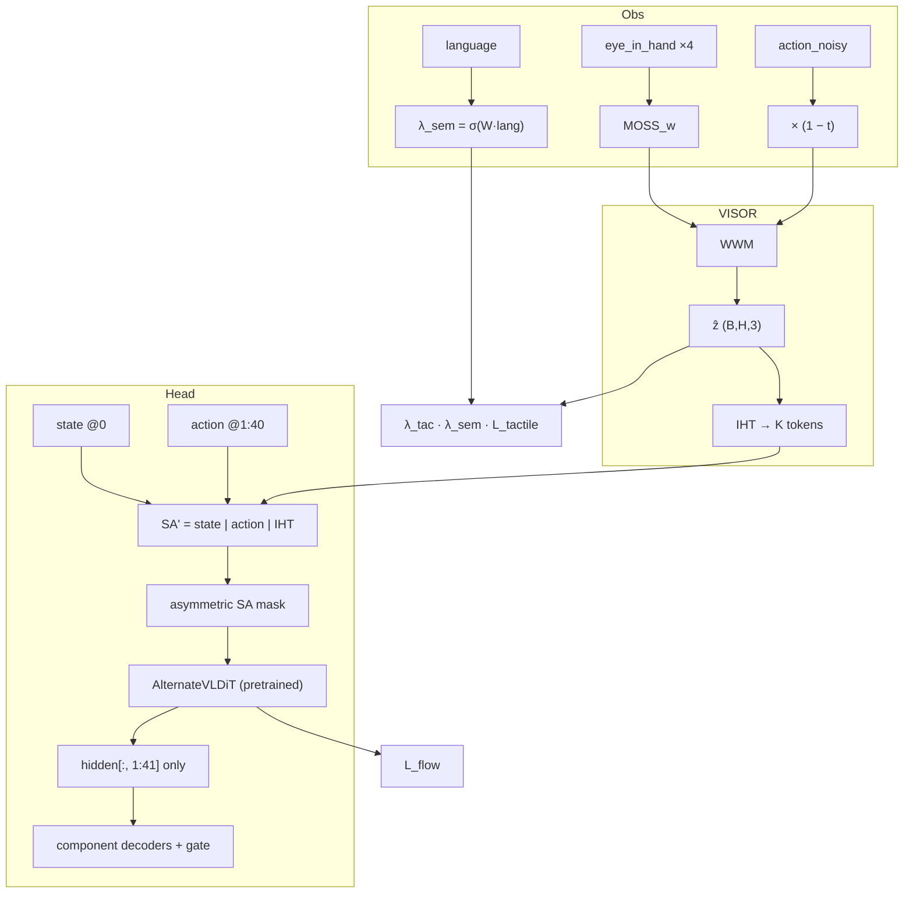

# VISOR 最终设计方案：Future Imagined Tactile × GR00T N1.7

> **文档状态**：Final Design v3.2（2026-06）  
> **首要约束**：strict reload `GR00T-N1.7-3B`；开启 VISOR 后 **Day-0 原生 action 路径与 baseline 等价**。  
> **问题设定**：无触觉硬件部署；用 **eye_in_hand 历史** 想象 **future 隐式触觉**，调制预训练 DiT policy。

---

## 0. 设计目标

| # | 目标 | 验收 |
|---|------|------|
| G1 | Reload 原 ckpt | missing keys 仅 `action_head.visor.*` |
| G1b | Day-0 等价 | 0 step 训练时 native slice 的 `L_flow` / eval ≈ A0 |
| G2 | 历史 wrist → future 触觉 | `eye_in_hand×4` → `ẑ[k], k=0..39` |
| G3 | Sensor-free deploy | 推理永不读 tactile 硬件 |
| G4 | Sim 监督 | in-place `tactile.left/right/contact`（1D FSR 对齐） |
| G5 | Component decode | `--use-component-factored-head` + `right_hand` gate |

**非目标**：WowSkin 15D 复刻；`--use-adaptive-component-head`；GelSight 级 force 重建。

---

## 0.1 设计决策评审（自评）

以下五条为 v3.1 引入的修订。**总体判断：前四条应作为 MVP 硬约束；第五条方向正确但 MVP 建议保留弱先验兜底。**

| # | 决策 | 合理性 | 自评 |
|---|------|--------|------|
| 1 | IHT 追加在序列 **末尾** | ✅ **强认同** | 代码已证实 action 使用 `position_embedding(arange(40))` 且 `sa=[state\|action]`（见 `gr00t_n1d7.py`）。mid-insert 不改变 action 上的 pos id，但会改变其在 DiT 序列中的 **绝对槽位**，进而影响与 VL 的 cross-attn 几何。末尾追加可保持 action 仍在 index `1:40`。 |
| 2 | 非对称 SA mask | ✅ **强认同** | near-zero init 不能保证 softmax 恒等：native query 若可见 IHT key，分母仍被分流。mask 是 **结构性** Day-0 保证，不写入 ckpt。 |
| 3 | `action × (1−t)` 消隐 | ✅ **认同** | flow 初段 `action_noisy≈𝒩(0,I)`，直接进 WWM 会产出无意义 ẑ 并经 gate 污染 gripper。乘性消隐简单有效；FiLM 可作 Full 增强。 |
| 4 | `log1p` + Huber | ✅ **认同** | 1–100N 动态范围下，线性 Huber 会被大力梯度主导，轻触（0→5N）信号被淹没。`log1p` 是低成本重标定；contact 仍用 BCE。 |
| 5 | 语义 λ gate 替代 blocklist | ⚠️ **方向对，MVP 需兜底** | 纯语言门控更泛化，但 NavigateKitchen 指令也可能含 manipulation 词汇；冷启动时 λ_sem 可能不准。建议 MVP 用 **语义门控为主 + 弱先验**（见 §5.2），Full 再完全依赖语义。 |

**实现警示（由代码审查得出）**：

- 当前 decode 为 `pred[:, -40:]`（取序列 **最后** 40 槽）。IHT 在末尾时 **必须** 改为 `pred[:, 1:41, :]`，否则会误读 IHT hidden。  
- IHT 槽位 `41..40+K` 需 **独立 position embed**（或固定 sin/cos），不可复用 action 的 `0..39` id。

---

## 1. 核心思路

**eye_in_hand 历史 MOSS + flow-time 消隐后的 noisy action → WWM 预测 future 隐式触觉；IHT 追加在 SA 末尾，native↛IHT 非对称 mask + zero-init decoder gate，在 strict reload 下调制预训练 DiT。**

训练：sim replay tactile GT + 语义门控 auxiliary loss。  
部署：无传感器；VISOR 输出仅内部调制 policy。

---

## 2. 观测与预测

### 2.1 输入

```text
eye_in_hand     delta_indices = [-6, -4, -2, 0]  → wrist_moss (B, 4, P, D_v)
action_noisy    (B, 40, D_a)                     → × (1 − flow_time) 后入 WWM
flow_time       t ∈ [0, 1]
language        pooled language_embeds             → semantic gate
agentview, proprio → 原有 GR00T 路径（不变）
```

### 2.2 输出

**MVP**：`ẑ[k] = [left, right, contact_logit] ∈ R³`，GT 来自 replay 写入的 `tactile.*` 列。  
**Full**：wrist contact field `C[k]`、`z_e`、`σ`（Phase 2）。

---

## 3. 架构



### 3.1 Wrist World Model（WWM）

```python
action_input = action_noisy * (1.0 - flow_time.view(B, 1, 1))
ẑ = WWM(wrist_moss, action_input, flow_time)   # (B, H, 3)；MVP 可先 8 waypoints 插值
```

flow 初段 action 几乎纯噪声；消隐避免 ẑ 随机波动经 gate 传导至 gripper。

### 3.2 IHT — 末尾追加（硬约束）

```text
SA' = [ state(1) | action(40) | IHT(K) ]     L = 41 + K，建议 K = 2
索引:     0      |   1 … 40   | 41 … 40+K
```

**禁止** `state | IHT | action`。

**原因**：GR00T 在 concat 前对 action 施加 `position_embedding(0..39)`，再 `cat(state, action)`。mid-insert 使 action 整体后移，破坏预训练时 action token 与 VL cross-attn 的对应关系。

**Position**：IHT 使用 **新增** embed（index `41..40+K`），与 action 的 `0..39` 分离。

**Decode 切片（必改）**：

```python
# 现有 baseline（无 IHT）
pred_actions = decoder_output[:, -40:]           # OK：序列末 40 即 action

# VISOR（IHT 在末尾）— 必须显式索引，禁止 -40:
h_action = hidden[:, 1:41, :]                    # state=0，action=1..40
pred_actions = component_decoders(h_action, ...)
```

### 3.2.1 非对称 Self-Attention Mask（Day-0 硬约束）

| Query \ Key | state | action | IHT |
|-------------|-------|--------|-----|
| state | ✓ | ✓ | **✗** |
| action | ✓ | ✓ | **✗** |
| IHT | ✓ | ✓ | ✓ |

```python
M = torch.zeros(L, L)
M[:41, :41] = 0
M[41:, :41] = 0
M[41:, 41:] = 0
M[:41, 41:] = float("-inf")    # native 不可见 IHT
scores = Q @ K.T / sqrt(d) + M
```

near-zero 初始化 **不能替代** 此 mask：只要 native 可见 IHT key，softmax 分母就被分流，Day-0 无法与 A0 对齐。

Mask 仅在前向注入；DiT 权重 strict load，不改 checkpoint。

**实现注意**：需确认 mask 施加在 AlternateVLDiT 内 **SA 流 self-attn**（非 VL cross-attn）。Cross-attn 路径保持原样。

### 3.3 Decoder Gate（MVP 主耦合）

```python
h' = h_action + gate * proj(pool(ẑ))    # gate, proj: zero-init → Day-0 h' ≡ h_action
out_hand = component_decoders["right_hand"](h')
```

Flat decoder 权重已通过 slice-copy 载入 component decoders（`--use-component-factored-head`）。

### 3.4 HyperMod（Full，默认关）

AlternateVLDiT 末 N 层 cross-attn 的 K/V 激活调制（`scale=1, shift=0` init）；不改 W 矩阵。

---

## 4. 预训练兼容

| 模块 | Load | Day-0 |
|------|------|-------|
| backbone, DiT, encoders, decoders | ✅ strict | 原生路径不变 |
| `visor.wwm.*` | missing | ẑ ≈ 0 |
| `visor.iht.*` | missing | 被 mask 隔离 |
| `visor.gate.*` | zero-init | 无增量 |
| `visor.semantic_gate.*` | missing | bias 初值 0.5 |

### Day-0 实验（必须通过后再训 VISOR）

| ID | 设置 | 期望 |
|----|------|------|
| D0-1 | suffix IHT + mask + gate zero + fade | `L_flow` ≈ A0 |
| D0-2 | 去掉 mask | 偏离 A0（验证 mask 必要） |
| D0-3 | mid-insert IHT | 偏离 A0（验证 suffix 必要） |
| D0-4 | decode 仍用 `[:, -40:]` | **错误行为**（验证切片必改） |
| D0-5 | 去掉 fade | 高 t 段 loss 抖动 |

```bash
--use-component-factored-head
--use-visor
# 禁止: --use-adaptive-component-head
```

---

## 5. 训练目标

### 5.1 总损失

```python
L_total = L_flow + λ_tac · λ_eff · L_tactile + λ_field · L_field
```

### 5.2 MVP：`L_tactile` 与门控

**力：log1p 空间 Huber**

```python
L_force = Huber(
    torch.log1p(ẑ[..., :2].clamp_min(0)),
    torch.log1p(gt[..., :2].clamp_min(0)),
)
L_contact = BCEWithLogits(ẑ[..., 2], gt_contact.float())
L_tactile = L_force + 0.5 * L_contact
```

线性 Huber 会被 60–100N 样本主导；log1p 放大 0→5N 轻触区间的梯度贡献。contact 通道保持 BCE，不做 log。

**语义门控（主路径）**

```python
λ_sem = torch.sigmoid(semantic_gate_proj(lang_pool))    # (B, 1)
```

**MVP 弱先验兜底（建议保留，非互斥）**

```python
# episode 内 GT contact 比例极低 → 下调 λ（不硬编码 task 名）
contact_rate = gt_contact.float().mean(dim=(1, 2))      # (B,)
λ_prior = (contact_rate / (contact_rate + 0.05)).clamp(0, 1)
λ_eff = λ_sem * λ_prior
```

NavigateKitchen 因 contact 近零，`λ_prior→0`，等效于旧 blocklist 但 **数据驱动**；PickPlace 高 contact 时 `λ_prior→1`。Full 阶段可逐步去掉 `λ_prior`，仅留 `λ_sem`。

废弃硬编码 `visor_task_blocklist` / `allowlist`。

### 5.3 Full / Co-denoise

Phase 2：`L_field`、HyperMod、symbiotic co-denoise。MVP 关闭。

---

## 6. 数据 Pipeline（已落地）

| 脚本 | 说明 |
|------|------|
| `generate_haptic_gripper_labels.py` | pad-only replay → in-place `tactile.*` |
| `run_haptic_labels_pretrain_batch.sh` | 3 任务 batch |

Dataloader（待实现）：`delta_indices=0..39` 对齐 future tactile 序列。

---

## 7. 推理与 Real

- 输入：eye_in_hand×4 + agentview + proprio + language  
- WWM：`action_input = action_noisy × (1 − t)`  
- `λ_sem` 低（或 `λ_prior` 低）→ 弱化 gate 与 tactile aux  
- Real：Stage B 仅 `L_flow`；不监督 force 数值  

---

## 8. 配置

```python
use_visor: bool = False
visor_iht_tokens: int = 2
visor_iht_at_suffix: bool = True              # 固定 True
visor_asymmetric_sa_mask: bool = True         # 固定 True
visor_action_noise_fade: bool = True
visor_decode_action_slice: tuple = (1, 41)    # 显式，禁止 -40:
visor_waypoints: int = 8
visor_loss_weight_tactile: float = 0.1
visor_use_contact_rate_prior: bool = True     # MVP 兜底；Full 可 False
visor_semantic_gate_dim: int = 4096
visor_warmup_steps: int = 1000                # 先 L_flow，后开 L_tactile
visor_coupled_denoise: bool = False
visor_hypermod_blocks: int = 0
```

---

## 9. 实现落点

| 优先级 | 文件 | 要点 |
|--------|------|------|
| P0 | `gr00t/model/modules/visor.py` | WWM, fade, IHT, gate, semantic_gate, losses |
| P0 | `gr00t_n1d7.py` | suffix pack, SA mask, **`hidden[:, 1:41]` decode** |
| P0 | `setup.py` | `_is_visor_key`, zero-init |
| P0 | Day-0 脚本 | D0-1 … D0-5 |
| P1 | dataloader + finetune script | tactile horizon |
| P2 | contact field, HyperMod | Full |

---

## 10. MVP Gate

| # | 实验 | 通过线 |
|---|------|--------|
| 1 | Day-0（D0-1） | `L_flow` ≈ A0 |
| 2 | PickPlace @10k | success ≥ +3% |
| 3 | NavigateKitchen @10k | 下降 ≤ 1% |
| 4 | log1p vs raw Huber | 轻触 contact 召回更高 |
| 5 | mask off（D0-2） | 故意失败，记录偏离量 |

---

## 11. Ablation

| ID | 配置 |
|----|------|
| A0 | component_factored baseline |
| A1 | + L_tactile + λ_sem + λ_prior |
| A2 | + suffix IHT + asymmetric mask |
| A3 | + decoder gate + WWM fade |
| A4 | A5/A6 负对照（mask off / mid-insert） |
| A5 | + HyperMod（Full） |

---

## 12. 风险

| 风险 | 缓解 |
|------|------|
| suffix IHT + 旧 `[:, -40:]` slice | 强制 `[:, 1:41]` |
| IHT 稀释 attention | asymmetric mask |
| flow 噪声 | `(1−t)` fade |
| 大力主导 loss | log1p Huber |
| 语义 gate 冷启动 | `λ_prior` from contact_rate |
| preload | visor.* missing OK；gate zero-init |

---

## 13. 路线

```text
[MVP] 1D GT ✅ → WWM(fade) + IHT(suffix+mask) + gate + λ_sem·λ_prior
  ↓
[Full] contact field + HyperMod
  ↓
[Real] sensor-free fine-tune
```

---

## 14. 参考

- Canvas：[visor-future-tactile.canvas.tsx](/HOME/sysu_xdliang/sysu_xdliang_1/.cursor/projects/HOME-sysu-xdliang-sysu-xdliang-1/canvases/visor-future-tactile.canvas.tsx)
- [Trajectory Visual Prompt Bridge](./trajectory_visual_prompt_bridge.md)
- Tactile GT：`examples/RoboCasa365/scripts/generate_haptic_gripper_labels.py`
- Position embed 源码：`gr00t/model/gr00t_n1d7/gr00t_n1d7.py` L230–237, L261–262

---

## 15. 总结

**VISOR 在 strict reload 下，通过 IHT 末尾追加 + native↛IHT 非对称 mask 保证 Day-0 等价；WWM 用 (1−t) 消隐 flow 噪声；log1p 力损失强调轻触；语义门控配合 contact-rate 弱先验调节 λ；zero-init gate 调制 right_hand——训练有 sim GT，部署无传感器。**
