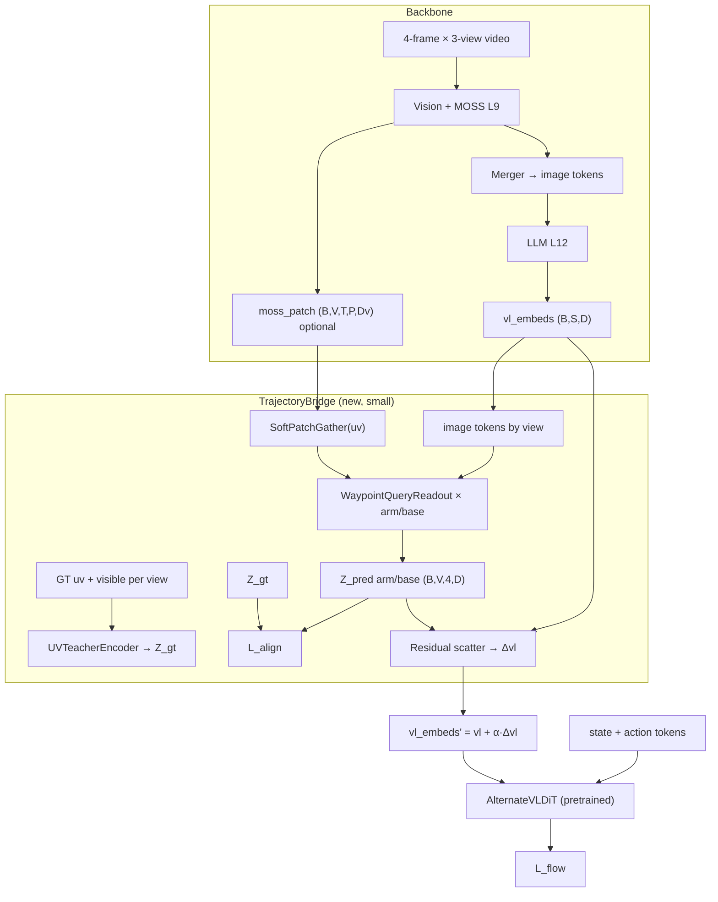

# Trajectory Visual Prompt Bridge（轨迹视觉提示桥接方案）

> 在 **保留 GR00T N1.7 预训练 AlternateVLDiT action decoder** 的前提下，用 arm/base 双流 2D 轨迹 GT 监督 VLM 视觉表征，并通过 residual 注入把视觉运动语义引导到下游动作生成。
>
> 适用：RoboCasa365 sim 标注（`lerobot_traj/`）及后续 real 数据（per-view 独立监督，不做跨视角几何一致）。

---

## 1. 目标与约束

| 目标 | 说明 |
|------|------|
| 视觉语义 → 动作 | VLM 中间层/图像 token 的运动与空间信息，经桥接模块影响 DiT cross-attention |
| 双流解耦 | **Arm stream**（EEF / 机械臂）与 **Base stream**（底盘）分开监督 |
| 预训练兼容 | **不改 DiT block 结构**；新增模块随机初始化；注入系数 `α=0` 时等价原模型 |
| 数据 | 多视角 per-camera `trajectory.*_uv.{camera}` + `visible`（见 `generate_trajectory_labels.py`） |

**不做（当前阶段）**

- Adaptive MSAT component head（decoder 无法直接 load 预训练 DiT）
- 跨视角几何一致 loss（sim 可自洽，real 标定误差下有害）
- 将多视角 uv 平均融合为单点 teacher

---

## 2. 现有管线与缺口

### 2.1 当前 VLM → Action 连接

```
Video (+ MOSS) → Qwen3-VL → backbone_features (LLM 最后一层, 混合 text+image token)
                                    ↓ vlln + vl_self_attention
                              AlternateVLDiT cross-attn (交替 attend 图像/文本 token)
                                    ↓
                              action_decoder → L_flow (flow matching)
```

- `Qwen3Backbone` 仅导出 `hidden_states[-1]` 与 `image_mask`（`gr00t/model/modules/qwen3_backbone.py`）
- MOSS 在 vision L9 注入运动，但 **patch 级中间特征未导出**到 action head
- 无 **2D 轨迹 ↔ 空间 patch** 的显式桥梁

### 2.2 时间轴

| 模态 | 时间范围 | 配置 |
|------|----------|------|
| Video / 轨迹 GT | `t-6, t-4, t-2, t`（4 点） | `robocasa365_config_4frame.py` |
| Action | `t … t+39`（40 步） | `ACTION_HORIZON=40` |

轨迹 GT 与 **4-frame 历史 video** 对齐；action hidden 是 **future 40 步**。  
因此：**对齐与注入应 primarily 在 VLM 视觉侧完成**，而不是把 future action hidden 硬 pool 成 4 点去对 past GT。

---

## 3. 推荐架构：Trajectory Bridge

### 3.1 总览



### 3.2 三条设计原则

1. **Teacher / Student 在视觉侧完成**  
   GT uv 监督的是「从 VLM 视觉 token / MOSS patch 读出的轨迹 latent」，不是 flat action 向量。

2. **回流用 residual 注入**  
   `vl_embeds' = vl_embeds + α · Δvl`  
   DiT 仍 cross-attend 同一接口；`α` 初值 0，不破坏预训练 load。

3. **Per-view 独立**  
   每个 camera 各算 arm/base align；**不做** left/right 几何一致项。

---

## 4. 模块说明

### 4.1 视觉特征来源（两层互补）

| 层级 | 来源 | 用途 |
|------|------|------|
| **Spatial（优先）** | MOSS 后 patch 特征 `(B, V, T, P, D)` | 2D uv 软采样、与 GT 对齐 |
| **Semantic** | `backbone_features[image_mask]` | 与 DiT 实际 attend 的 K/V 同空间 |

Student readout 优先用 MOSS patch；对齐后将 `Z_vis` **scatter 回** 对应 view 的 image token 位置，得到 `Δvl`。

### 4.2 Teacher（GT，stop-grad）

```python
Z_gt_arm[v]  = MLP_arm(uv_arm[v])      # (B, 4, D_traj)
Z_gt_base[v] = MLP_base(uv_base[v])
# masked by visible[v]; eye_in_hand 上 arm 不参与
```

- 坐标：归一化 `[0,1]`，与 video crop/resize **同步变换**
- Sim：MuJoCo 投影（`trajectory_projection.py`）
- Real：per-view 独立，不融合 uv

### 4.3 Student（PerViewTrajectoryReadout）

对每个 view `v`、waypoint `k ∈ {0,1,2,3}`（对应 4 帧）：

```python
# 1) uv 处软 gather patch（可微）
patch_feat = soft_gather(moss_patch[v, t_k], uv[v, k])

# 2) waypoint query cross-attend 该 view 的 patch / image token 序列
Z_pred = TrajectoryReadout(queries=Q[k], kv=img_tokens[v])  # (B, 4, D_traj)

L_align = masked_cosine(Z_pred, Z_gt, visible)
```

- **Arm / Base 两套独立 Readout**（双流）
- 共享 patch 输入，不共享 head 权重

### 4.4 注入 DiT（指导 action 生成）

**Phase 1（推荐）**

```python
Δvl = TrajectoryInjector(Z_vis, uv, image_token_layout)  # (B, S, D)
vl_embeds' = vl_embeds + α * Δvl   # α=0 init 或 learnable scalar
```

- 只加在 **image token** 上；文本 token 不变
- AlternateVLDiT 在 image cross-attn block 读到轨迹增强特征 → 间接指导 flow matching

**Phase 2（可选）**

```python
L_guide = cos( ActionReadout(h_action[:, :4]), pool(Z_vis) )  # 小权重 ~0.05
```

**Phase 3（慎用）**

- 在 SA 序列插入 `traj_ctx` token → 改序列长度，预训练兼容性变差

### 4.5 总 loss

```python
loss = L_flow + λ(step) * Σ_v w[v] * ( L_align_arm[v] + L_align_base[v] )
# λ: 0 → 0.1，warmup ~500 steps
# α: 0 → 0.05 或可学习
```

日志建议分开：`flow_loss / align_arm / align_base / inject_norm`。

---

## 5. 多视角数据用法

### 5.1 Parquet 列（已生成）

| 列 | 含义 |
|----|------|
| `trajectory.arm_uv.{camera}` | arm/EEF 归一化 `(u,v)` |
| `trajectory.base_uv.{camera}` | base 参考点 |
| `trajectory.arm_visible.{camera}` | 是否有效 |
| `trajectory.base_visible.{camera}` | 是否有效 |

### 5.2 相机分工（与标注脚本一致）

| 流 | 相机 | 说明 |
|----|------|------|
| **Arm** | `agentview_left`, `agentview_right` | 外参视角；EEF 有运动 |
| **Arm** | `eye_in_hand` | **跳过**（相机与 EEF 共动，uv 近静态） |
| **Base** | 三视角均可 | base 相对 hand 相机会动 |

### 5.3 Per-view loss 权重（Sim 初始值）

| 流 | 相机 | 权重 |
|----|------|------|
| Arm | left / right | 1.0 |
| Arm | eye_in_hand | 0 |
| Base | left / right | 1.0 |
| Base | eye_in_hand | 0.5–1.0 |

任务可调：Navigate 略增 base；PickPlace 略增 arm。

### 5.4 Sim vs Real

| 策略 | Sim | Real |
|------|-----|------|
| Per-view align | ✅ | ✅ |
| Cross-view 一致 loss | 可选、权重极小 | ❌ 不建议 |
| View dropout | 可选 | **推荐**（每 step 随机 1–2 视角） |
| Robust loss | 可选 | **推荐**（cosine / Huber + visible mask） |
| 融合多视角 GT | ❌ | ❌ |

Real 误差来源：外参/内参、时间同步、标注 jitter、共动相机语义差异 → 用 **mask + per-view 独立 loss** 吸收，不用几何硬约束。

### 5.5 标注可视化 PNG

- **用途**：质检（arm 是否动、base 是否合理、哪路常不可见）
- **不直接进训练**；训练读 parquet 的 `uv` + `visible`

---

## 6. 与 MOSS / 预训练 DiT 的关系

```
MOSS (vision L9)     →  patch 级运动感知
Trajectory Bridge    →  arm/base 语义 + 2D GT 对齐
Δvl 注入             →  LLM image token 增强
AlternateVLDiT       →  预训练权重完整 load，cross-attn 读 vl_embeds'
L_flow               →  原有 flow matching 不变
```

- MOSS：解决「看见运动」（已有提升）
- Bridge：解决「arm/base 运动语义分开 + 绑到空间位置」
- 二者互补，非重复

---

## 7. 实现落点（Phase 1）

| 文件 | 改动 |
|------|------|
| `gr00t/model/modules/qwen3_motion.py` | export `moss_patch_features` + view/frame layout meta |
| `gr00t/model/modules/qwen3_backbone.py` | 可选 `vision_sidecar`（不改主 `backbone_features` 路径） |
| **新建** `gr00t/model/modules/trajectory_bridge.py` | Encoder / Readout / Injector / loss |
| `gr00t/model/gr00t_n1d7/gr00t_n1d7.py` | ActionHead：`vl_embeds += α·Δvl`；合并 loss |
| `gr00t/model/gr00t_n1d7/processing_gr00t_n1d7.py` | 加载 per-view trajectory GT；collator |
| `gr00t/data/dataset/lerobot_episode_loader.py` | `ALLOWED_MODALITIES` 增加 `trajectory` |
| `examples/RoboCasa365/robocasa365_config_4frame.py` | `trajectory` modality（与 video 相同 delta_indices） |
| `gr00t/configs/model/gr00t_n1d7.py` | `use_trajectory_bridge`, `traj_align_weight`, `traj_inject_alpha`, … |
| `gr00t/configs/finetune_config.py` + `launch_finetune.py` | CLI 透传 |
| `gr00t/model/gr00t_n1d7/setup.py` | checkpoint 容忍 `trajectory_bridge.*` missing keys |

**不必改** `trainer.py`（`forward` 返回单一 `loss` 即可）。

### 7.1 配置字段（建议）

```python
use_trajectory_bridge: bool = False
traj_align_weight: float = 0.1
traj_inject_alpha: float = 0.0          # 或 learnable，训练中升至 ~0.05
traj_latent_dim: int = 64
traj_num_waypoints: int = 4             # = len(VIDEO_DELTA_INDICES)
traj_view_dropout_prob: float = 0.0     # real 可调 0.3–0.5
traj_align_warmup_steps: int = 500
```

### 7.2 Batch 字段（processor → collator）

```python
arm_traj_uv:      dict[camera] -> (B, 4, 2)   # 或 stacked (B, V, 4, 2)
base_traj_uv:     dict[camera] -> (B, 4, 2)
arm_traj_visible: dict[camera] -> (B, 4)
base_traj_visible: dict[camera] -> (B, 4)
```

---

## 8. 训练与 Ablation 建议

### 8.1 实施顺序

1. 轨迹标注跑完（`run_trajectory_labels_pretrain_batch.sh` → `lerobot_traj/`）
2. Phase 1：`use_trajectory_bridge=False` 跑通数据 loader；再开 align + 小 `λ`
3. Sanity：`λ=0` 时 loss 与 motion-only 一致
4. Ablation：motion-only vs motion + bridge，同 10k/30k eval

### 8.2 实验矩阵

| 实验 | 说明 |
|------|------|
| A | motion-only + native DiT（baseline） |
| B | A + Trajectory Bridge（本方案） |
| C | B + view dropout（real 准备） |

### 8.3 Finetune 脚本（示意）

在 `finetune_pickplace_motion_30k.sh` 基础上：

```bash
USE_TRAJECTORY_BRIDGE=1
TRAJ_DATA_ROOT=.../lerobot_traj    # 或合并后的数据根
--use-trajectory-bridge --traj-align-weight 0.1
```

---

## 9. 相关文件索引

| 路径 | 说明 |
|------|------|
| `examples/RoboCasa365/scripts/trajectory_projection.py` | Sim 3D→2D 投影、arm/base 相机策略 |
| `examples/RoboCasa365/scripts/generate_trajectory_labels.py` | 并行写 LeRobot trajectory 列 |
| `examples/RoboCasa365/run_trajectory_label_generation.sh` | 单任务标注入口 |
| `examples/RoboCasa365/run_trajectory_labels_pretrain_batch.sh` | 批量 pretrain 任务 |
| `examples/RoboCasa365/robocasa365_config_4frame.py` | 4-frame video + action 配置 |
| `gr00t/model/gr00t_n1d7/gr00t_n1d7.py` | `Gr00tN1d7ActionHead` + AlternateVLDiT |
| `gr00t/model/modules/qwen3_motion.py` | MOSS / vision forward patch |

---

## 10. 一句话总结

**Trajectory Bridge = 在 VLM 视觉 token 上做 arm/base 双流轨迹 readout 与 GT 对齐，再通过 `vl_embeds` 的 residual 注入接入预训练 AlternateVLDiT**——视觉语义先进 VLM 表征，再经原有 cross-attention 指导动作生成，无需更换 action decoder 或 MSAT。
