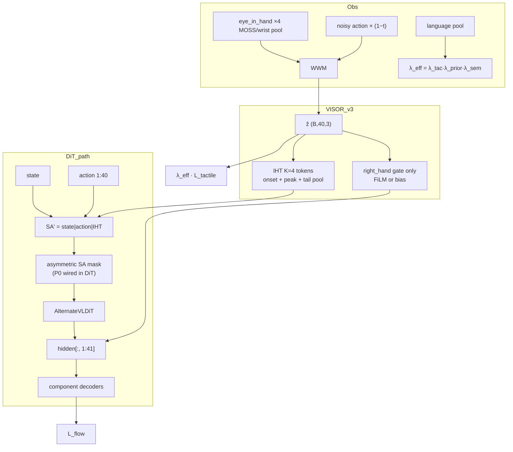

# VISOR v3 改进方案：从「触觉预测准」到「策略真的用上」

> **文档状态**：Draft v3.0（2026-06-16）  
> **前置**：基于 v2 r2 实验复盘（`tactile_loss↓` 但 PickPlace success 26% vs baseline 50% / v1 58%）  
> **约束不变**：strict reload `GR00T-N1.7-3B`；部署无触觉硬件；`--use-component-factored-head`  
> **关联文档**：[imagined_haptics_bridge.md](./imagined_haptics_bridge.md)（v3.2 原始设计，部分未落地）

---

## 0. v2 复盘：为什么「预测准」≠「性能好」

| 现象 | 根因 | v3 必须修 |
|------|------|-----------|
| `tactile_loss` 训练末 ~0.03 | WWM 在 **clean-action 旁路** 上拟合 GT | 统一 train/infer 的 WWM 输入 |
| `gate ≈ 8e-5`（v1/v2 皆然） | `gate` 与 `gate_proj` **双重零初始化** → flow 梯度无法打开耦合 | 改初始化 + 耦合 warmup |
| IHT 已 append 但 Day-0 无保证 | `sa_self_attention_mask` 传入 DiT **未被消费** | P0：DiT self-attn 真正接 mask |
| 可视化 contact/force 曲线好 | 评估脚本用 **clean WWM**；推理用 faded noisy action | 指标与 loss 对齐 flow-time |
| v2 success 低于 baseline | 高 `λ_tac=0.5` + proprio-redundant WWM + 未隔离 IHT | 降 aux 权重、减冗余、修 mask |
| 设计写 right_hand gate | 实现中对 **全 action hidden** 加 bias | 按 component segment 注入 |

**v3 核心命题**：不再追求「把 tactile loss 压得更低」，而是保证 **同一条 WWM 输出** 在 **flow-time 推理路径** 上，以 **可学习的、非零的、部位正确的** 方式调制 DiT decoder。

---

## 1. v3 设计原则

1. **一条 WWM，两条用途，同一前向**：policy 与 auxiliary 共用 `ẑ = WWM(...)`，禁止 clean-only 监督旁路（可用 stop-gradient 选项做 ablation，但默认关闭）。
2. **结构保证 Day-0**：native `state|action` 在 0 step 时与 A0 等价——靠 **非对称 SA mask**（必须接入 DiT），不靠 near-zero 碰运气。
3. **耦合可学习**：避免 `gate × proj` 双零死区；gate 初值小但非零，或只 zero-init 一侧。
4. **视觉想象 > proprio 回归**：WWM 默认 **不看 proprio**（或训练时 dropout）；vision 只用 **eye_in_hand 相关 token**。
5. **时序信息进 policy**：IHT 保留 contact onset / 分段池化，禁止 `mean(dim=1)` 压成标量。
6. **渐进启用**：`visor_warmup_steps` 先纯 `L_flow`，再开 `L_tactile` 与 gate ramp。

---

## 2. v3 架构总览



与 v2 的三处本质差异：

| 模块 | v2 | v3 |
|------|----|----|
| WWM 输入 | 全 VL mean pool + proprio + action | **wrist vision pool** + faded action；proprio 默认关 |
| Tactile 监督 | clean action 单独 forward | **与 policy 同一** `tactile_pred`（flow-time） |
| Policy 耦合 | 全局 `gate·proj(mean ẑ)` | **right_hand segment** + gate ramp；IHT 时序 token |

---

## 3. P0：必须先修（否则不做 v3 训练）

### 3.1 DiT 接入非对称 SA mask

**问题**：`visor_factored_action_head._run_dit()` 传入 `sa_self_attention_mask`，但 `AlternateVLDiT.forward` 无此参数，self-attn 块固定 `attention_mask=None`。

**改法**：

```python
# gr00t/model/modules/dit.py — AlternateVLDiT.forward
def forward(..., sa_self_attention_mask: Optional[torch.Tensor] = None):
    ...
    if idx % 2 == 1:  # self-attention block
        hidden_states = block(
            hidden_states,
            attention_mask=sa_self_attention_mask,  # (B, 1, L, L) or broadcastable
            ...
        )
```

**Mask 语义**（与现 `build_asymmetric_sa_mask` 一致）：

| Query \ Key | state | action | IHT |
|-------------|-------|--------|-----|
| native (0:41) | ✓ | ✓ | **✗** |
| IHT (41:) | ✓ | ✓ | ✓ |

**验收 D0-1**：加载 N1.7 ckpt、0 step、`use_visor=True` → `L_flow` 与 component-factored A0 差 < 1e-3（同 batch）。

**验收 D0-2**：故意 `mask=None` → `L_flow` 相对 A0 明显偏离（记录 Δ 作为回归测试）。

### 3.2 统一 WWM 前向（去掉 clean 监督旁路）

**问题**：训练里 `tactile_pred_supervised` 用 `use_clean_action=True`，与推理 `get_action_with_features` 不一致。

**改法**：

```python
# visor_factored_action_head.forward — 单一 WWM 输出
tactile_pred = self.visor.wwm(
    noisy_trajectory, t, wrist_context, proprio=None, use_clean_action=False,
)
# loss
if tactile_gt is not None:
    tactile_loss, stats = self.visor.compute_tactile_loss(tactile_pred, tactile_gt)
```

**可选 ablation flag**：`visor_tactile_supervise_clean: bool = False`（仅对照实验开启）。

**验收**：`visualize_visor_tactile.py` 默认报告 **flow-time @ t∈{0,0.25,0.5,1.0}** 指标，clean 仅作 debug 曲线。

### 3.3 Gate 初始化与 Warmup（打开耦合）

**问题**：`gate=0` 且 `gate_proj=0` → 乘积梯度死区。

**v3 默认**：

```python
# visor.py
self.gate = nn.Parameter(torch.tensor([0.1]))          # 小正值，非零
_zero_init_linear(self.gate_proj)                       # 仅 proj 零初始化 → Day-0 仍近似恒等
# 或备选：gate=0, gate_proj 用 Xavier（二选一，推荐前者）
```

**Gate ramp**（训练前 `visor_gate_warmup_steps=2000`）：

```python
gate_eff = self.visor.gate * min(1.0, global_step / gate_warmup_steps)
hidden_action[..., seg] += gate_eff * delta
```

**验收**：1k step 后 `|gate_eff| > 0.05`；10k step 后 sim probe 中 gate 关闭 vs 开启 ablation 有 measurable Δ。

---

## 4. P1：针对性耦合（v3 主体价值）

### 4.1 Wrist-only vision context

**问题**：`pool_vision_context` 对 agentview + eye_in_hand 全池化，WWM 不必学视觉想象。

**改法**：

- 在 `backbone_output` 中利用 `image_mask` + **camera index**（或 metadata）筛 `robot0_eye_in_hand` token；
- 若无 per-camera mask，MVP 方案：对 3 路相机 VL token 按固定 slice（由 processor 布局确定）取 **最后 1/3** eye_in_hand tokens 做 mean pool；
- Full：直接接 MOSS wrist patch embedding（`motion` 模块已有 4-frame 路径，可复用 pooled wrist feature）。

```python
def pool_wrist_context(self, vl_embeds, image_mask, eye_in_hand_mask) -> Tensor:
    m = (image_mask & eye_in_hand_mask).unsqueeze(-1)
    return (vl_embeds * m).sum(1) / m.sum(1).clamp(min=1)
```

**验收 ablation**：`wrist_only` vs `full_vl_pool` → 在 **held-out proprio dropped** 时 contact recall 下降应小于 full pool（说明视觉依赖真实）。

### 4.2 Proprio dropout（打破冗余捷径）

```python
# WWM forward
if self.training and self.visor_proprio_dropout > 0:
  if torch.rand(B) < p: proprio = torch.zeros_like(proprio)
```

默认 `visor_proprio_dropout=0.5`；NavigateKitchen（低 contact）可配合 `λ_prior` 自动降低 tactile 权重。

### 4.3 时序 IHT（K=4）替代标量 mean

将 `ẑ` 按时间分段池化，而非整条 horizon mean：

```text
segments (H=40):
  approach : steps 0–15   → token 0  (预接触)
  onset    : steps 16–23  → token 1  (首触附近，权重最高)
  peak     : steps 24–31  → token 2  (夹持)
  release  : steps 32–39  → token 3  (释放/滑移)
```

```python
def build_iht_tokens(self, tactile_pred):  # (B,H,3) -> (B,4,D)
    chunks = [tactile_pred[:, s:e] for s,e in self.iht_segments]
    pooled = [c.mean(dim=1) for c in chunks]
    tokens = torch.stack([self.iht_proj[i](pooled[i]) for i in range(4)], dim=1)
    return tokens + self.iht_pos_embed
```

`iht_segments` 可配置；contact onset 可用 `argmax(contact)` 动态对齐（Phase 1.5）。

### 4.4 Right-hand-only decoder gate

**问题**：v2 对全部 `hidden_action` 加相同 bias，干扰 arm/base。

**改法**：在 `decode_action_hidden` 之前，只对 `right_hand` 对应 hidden 通道加调制：

```python
# component_layout: gripper_close -> right_hand segment
rh_slice = self._right_hand_hidden_slice()  # indices in action_dim / hidden per-step
delta = self.visor.gate_proj(event)         # (B, D_hidden)
hidden_action[:, :, rh_slice] += gate_eff * delta.unsqueeze(1)
```

或 **FiLM**（更强但仍是 Day-0 safe）：

```python
γ, β = self.visor.film(event).chunk(2, dim=-1)   # zero-init → γ=0, β=0 → 恒等
h_rh = h_rh * (1 + gate_eff * γ) + gate_eff * β
```

**验收**：NavigateKitchen eval 下降 ≤ 1%（相对 A0）；PickPlace 提升 ≥ +3%（MVP 线，见 §8）。

### 4.5 损失权重与 λ 调度（修正 v2 过拟合 aux）

| 超参 | v2 r2 | **v3 默认** | 说明 |
|------|-------|-------------|------|
| `visor_loss_weight_tactile` | 0.5 | **0.1** | 回到 v1 量级；aux 不能压过 flow |
| `visor_contact_loss_weight` | 1.0 | **0.5** | 力与接触平衡 |
| `visor_warmup_steps` | 无 | **1000** | 先 flow 再 tactile |
| `visor_gate_warmup_steps` | 无 | **2000** | 防早期噪声 ẑ 伤 gripper |
| `use_contact_rate_prior` | False | **True** | 数据驱动降权低接触 episode |
| `visor_proprio_dropout` | 0 | **0.5** | 打破捷径 |

**语义门控**（P1.5，简单版）：

```python
λ_sem = sigmoid(Linear(lang_pool))           # init bias=0 → 0.5
λ_prior = contact_rate / (contact_rate + 0.05)
λ_eff = λ_sem * λ_prior
loss = L_flow + λ_eff * L_tactile
```

---

## 5. P2：验证与增强（v3 稳定后再做）

| ID | 内容 | 目的 |
|----|------|------|
| P2-1 | HyperMod：末 2 层 cross-attn K/V 用 `ẑ` FiLM | 比 IHT 更深耦合，仍 zero-init |
| P2-2 | Flow-time 分层监督：对 `t>0.5` 的 batch 加大 tactile loss 权重 | 对齐 denoise 后段更有信息的 ẑ |
| P2-3 | Coupled denoise：contact 高时放大 gripper velocity loss | 显式把触觉与动作绑定 |
| P2-4 | 动态 IHT 分段（onset-aligned） | 适应 variable-length contact |
| P2-5 | Dream–Real bridge（DRHB） | 真实触觉 encoder 与 WWM 共空间 |

---

## 6. 训练与评估配方

### 6.1 推荐实验矩阵（PickPlace MVP）

| ID | 配置 | 预期 |
|----|------|------|
| A0 | component_factored, no VISOR | ~50% 基线 |
| V3-0 | P0 only（mask + unified WWM + gate fix） | Day-0 过；success ≥ A0 |
| V3-1 | P0 + wrist pool + proprio dropout | tactile 更难但 policy 更涨 |
| V3-2 | V3-1 + temporal IHT K=4 | onset 召回 ↑ |
| V3-3 | V3-2 + right_hand gate | **主实验**；目标 ≥ 55% |
| V3-neg | V3-3 but `mask=None` | 故意劣于 V3-3 |

### 6.2 脚本

```bash
# 新增
examples/RoboCasa365/finetune_pickplace_visor_v3_30k.sh

# 关键 flags（拟新增到 launch_finetune.py / finetune_config.py）
--use-component-factored-head --use-visor
--visor-loss-weight-tactile 0.1
--visor-warmup-steps 1000
--visor-gate-warmup-steps 2000
--visor-proprio-dropout 0.5
--visor-wrist-only-vision
--visor-iht-tokens 4
--visor-use-contact-rate-prior
```

### 6.3 必打指标（训练 log + offline）

| 指标 | 说明 |
|------|------|
| `flow_loss` | 主任务，不能与 A0 背离 |
| `tactile_loss` | aux；应下降但 **非 KPI** |
| `visor_gate_eff` | 当前 step 的 ramp 后 gate |
| `visor_contact_recall@flow_t` | 按 flow time 分桶 |
| `visor_force_mae@contact` | 仅 contact 步 |
| **sim success** | **唯一北极星** |

### 6.4 Offline 可视化

扩展 `scripts/visualize_visor_tactile.py`：

1. 打印 `gate`、`gate_eff`、`λ_eff`  
2. 默认 metrics 用 `use_clean_action=False` + `t∈{0,0.25,0.5,1.0}`  
3. 新增「gate ablation」：`gate=0` vs trained gate 的 ẑ 与 action 差异

---

## 7. 配置项（拟新增 / 变更）

```python
# gr00t/configs/model/gr00t_n1d7.py & finetune_config.py

# --- v3 新增 ---
visor_gate_init: float = 0.1
visor_gate_warmup_steps: int = 2000
visor_warmup_steps: int = 1000
visor_proprio_dropout: float = 0.5
visor_wrist_only_vision: bool = True
visor_use_proprio_in_wwm: bool = False          # 默认关
visor_tactile_supervise_clean: bool = False     # ablation only
visor_iht_segments: list[tuple[int,int]] = [(0,16),(16,24),(24,32),(32,40)]
visor_gate_component: str = "right_hand"          # 只调制该 component
visor_use_semantic_gate: bool = True
visor_semantic_gate_dim: int = 4096
visor_use_contact_rate_prior: bool = True

# --- v3 变更默认 ---
visor_iht_tokens: int = 4                         # 原 2
visor_loss_weight_tactile: float = 0.1            # 原 0.5
visor_contact_loss_weight: float = 0.5            # 原 1.0
```

---

## 8. MVP 通过线（与 v3.2 文档对齐并收紧）

| # | 实验 | 通过线 |
|---|------|--------|
| 1 | Day-0（P0 mask + gate init） | `L_flow` ≈ A0（Δ < 1e-3） |
| 2 | D0-2 mask off | 相对 A0 偏离显著（回归测试） |
| 3 | PickPlace @30k V3-3 | success **≥ 55%**（baseline ~50%，v1 58%） |
| 4 | NavigateKitchen @10k V3-3 | 下降 **≤ 1%** vs A0 |
| 5 | Gate ablation @30k | 关闭 gate 后 success 下降 ≥ 2%（证明耦合有效） |
| 6 | Flow-time tactile recall | `@t≥0.5` recall 不低于 clean 的 85% |

---

## 9. 实现路线图

### Phase 0 — 基础设施（1–2 天）

| 文件 | 改动 |
|------|------|
| `gr00t/model/modules/dit.py` | `AlternateVLDiT` / `DiT` 接 `sa_self_attention_mask` |
| `gr00t/model/modules/visor/visor_factored_action_head.py` | 去掉 clean WWM 旁路；gate ramp；right_hand slice |
| `gr00t/model/modules/visor/visor.py` | gate_init；wrist pool；proprio dropout；temporal IHT |
| `gr00t/configs/model/gr00t_n1d7.py` | v3 配置项 |
| `gr00t/configs/finetune_config.py` | CLI flags |
| `gr00t/experiment/launch_finetune.py` | 传参 + log `gate_eff` |
| `gr00t/experiment/trainer.py` | 已有 visor metrics，补 `gate_eff` |

**Day-0 单测**：`tests/gr00t/model/test_visor_day0.py`（新建）

### Phase 1 — 主实验（2–3 天）

| 文件 | 改动 |
|------|------|
| `examples/RoboCasa365/finetune_pickplace_visor_v3_30k.sh` | 训练入口 |
| `examples/RoboCasa365/scripts/visualize_visor_tactile.py` | flow-time 默认指标 |
| `examples/RoboCasa365/scripts/visor_day0_check.sh` | D0-1/D0-2 快捷脚本 |

### Phase 2 — 泛化（可选）

- `finetune_navigate_kitchen_visor_v3_10k.sh`：验证 `λ_prior`  
- DeliverStraw composite：测语义门控

---

## 10. 风险与缓解

| 风险 | 缓解 |
|------|------|
| mask 实现错误导致 attention 数值问题 | 单测 mask 对称性；fp32 下对比 softmax 权重 |
| gate 过早打开污染 gripper | `gate_warmup` + `(1-t)` fade 保留 |
| 去掉 proprio 后 tactile loss 上升 | 预期行为；以 sim success 为准 |
| wrist token slice 硬编码脆弱 | processor 输出 `eye_in_hand_token_mask`（中期） |
| IHT 变 4 token 略增显存 | K=4 仅 +2 token vs v2 K=2；可忽略 |
| v1 checkpoint 不兼容 | `visor.*` 本就不 strict；v3 重新训 30k |

---

## 11. 与 v2 / 原设计文档关系

- **保留**：suffix IHT、log1p Huber、contact onset boost、component-factored decode、`hidden[:,1:41]` 切片  
- **修正**：非对称 mask 真正接入 DiT；right_hand gate；统一 WWM 路径  
- **回收 v3.2 未实现项**：`λ_prior`、`λ_sem`（P1.5）、`visor_warmup`  
- **推迟**：HyperMod、contact field、co-denoise → P2  

---

## 12. 总结

**VISOR v3 的本质不是换一个更大的 WWM，而是修三条断链：**

1. **DiT ← IHT**（mask 必须生效）  
2. **WWM → decoder**（gate 必须打开、部位正确、train=infer）  
3. **视觉 → 触觉**（wrist-only、去 proprio 捷径）  

建议实施顺序：**P0 全部完成并通过 Day-0 → 只跑 V3-0 确认 success ≥ A0 → 再叠 P1 做 V3-3 主实验**。不要在 P0 未修时继续调 `λ_tac` 或 WWM 容量，否则只会得到「更准的旁路」。

---

## 附录 A：P0 伪代码（DiT mask）

```python
# AlternateVLDiT.forward — self-attn layers only
if idx % 2 == 1 and self.config.interleave_self_attention:
    attn_mask = sa_self_attention_mask
    if attn_mask is not None and attn_mask.dim() == 3:
        attn_mask = attn_mask.unsqueeze(1)  # (B,1,L,L)
    hidden_states = block(
        hidden_states,
        attention_mask=attn_mask,
        encoder_hidden_states=None,
        encoder_attention_mask=None,
        temb=temb,
    )
```

## 附录 B：Right-hand hidden 切片

RoboCasa `component_action_key_order` 下 `gripper_close` 映射到 `right_hand`（1D）。  
在 `ComponentFactoredActionHead` 中 `decoder_segments` 已含 `right_hand` 的 `(start, end)`；gate 作用在 **decoder 前的 full hidden** 时，对 **所有 40 步** 的 hidden 向量加 **同一** `delta`（shape 与 hidden 维一致），但 **只累加到将送入 `component_decoders["right_hand"]` 的那部分表征**——实现上可在 `decode_action_hidden` 内：

```python
for seg in self.decoder_segments:
    h_seg = hidden
    if seg.name == "right_hand":
        h_seg = h_seg + gate_eff * self.visor.gate_proj(event).unsqueeze(1)
    pred[:, :, seg.start:seg.end] = self._decoder_for_segment(seg)(h_seg, embodiment_id)
```

注意：若 decoder 是 per-step MLP on full hidden，则应对进入 **right_hand decoder 的 hidden** 调制，而非 action_dim 切片（与 v2 的 `action_dim` 混淆点）。
